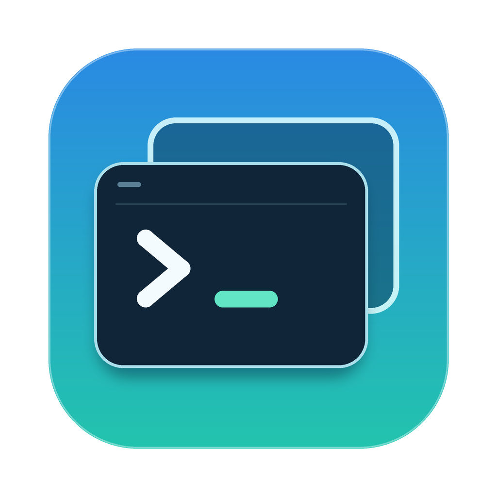

<div align="center">



# UUTmux

在菜单栏里查看、创建、打开和结束网易 UU 远程的终端会话，并可选地把手机端新建的会话自动镜像到 iTerm2。

</div>

UUTmux 是独立的第三方开源项目，并非网易 UU 官方产品。它调用 UU 在本机提供的命令行工具和内置 tmux socket，需要自行安装并登录网易 UU 远程。

## 功能

- **会话列表**：菜单栏常驻，管理窗口以表格展示名称、状态、当前程序和工作目录，顶部搜索框可即时过滤。
- **紧凑操作**：每行内联「打开 / 结束」图标按钮；结束会话前弹确认框，并显示将被终止的程序、目录与连接数。
- **右键菜单**：选中一行后右键可打开、重命名或结束会话。
- **实时状态**：窗口底部显示连接状态与最后一次成功刷新时间，列表约每 2 秒刷新。
- **可选自动镜像**：为新出现且已连接的外部会话自动在 iTerm2 中开窗；UU 预留的空会话后来首次被接入时也会触发。默认关闭，启动或启用时不会为已经连接的会话批量开窗，本地操作和已镜像的会话不会重复开窗。
- **可选登录启动**：默认关闭，可在菜单栏切换。

## 环境要求

- macOS 14 或更新版本
- 已安装并登录**网易 UU 远程**，其提供 `uuyc-cli lterm` 及内置 tmux socket（`~/Library/Application Support/UURemote/tmux.sock`）
- **iTerm2**（用于打开和镜像会话）
- 构建需要 **完整版 Xcode** 与 [**xcodegen**](https://github.com/yonaskolb/XcodeGen)

## 安装

### Homebrew（推荐）

```bash
brew tap alliottech/tap
brew install --cask alliottech/tap/uutmux
xattr -dr com.apple.quarantine /Applications/UUTmux.app
```

App 为 ad-hoc 签名、未经 Apple 公证，Gatekeeper 会拦截，上面的 `xattr` 命令清除隔离标记后即可打开。也可到 [Releases](https://github.com/AlliotTech/uu-tmux/releases/latest) 下载 DMG 手动安装。

## 从源码构建

也可以自行构建：

```bash
brew install xcodegen

just build      # 生成 build/UUTmux.app
just install    # 安装到 ~/Applications/UUTmux.app
```

安装后从 `~/Applications` 启动 UUTmux。首次通过 App 打开或镜像会话时，macOS 会请求「自动化」权限以控制 iTerm2，在系统设置中允许即可。

`just build` 用 xcodegen 生成 Xcode 工程并以 Release 配置编译；`just install` 仅将 `.app` 拷贝到 `~/Applications`。安装和升级前请先退出正在运行的 UUTmux。

## 使用

- 菜单栏菜单显示连接状态与最近会话；「打开管理窗口」进入完整列表。
- 关闭管理窗口不会退出 App，菜单栏继续运行；从菜单栏「退出」才会结束 App，且不会终止任何 UU 会话。
- 「结束」会终止会话及其中运行的程序，需二次确认；「打开」在 iTerm2 中接入该会话。
- 「为外部新会话自动开窗」和「登录时启动」两个可选开关都在菜单栏，默认关闭。

## 从旧版脚本升级

早期的 shell 版本用一个 launchd watcher（标签 `com.uu-term-bridge.watch`）轮询并开窗。**在启用自动镜像前必须先停用它**，否则两者会对同一会话重复开窗。可自行运行（本项目不会代为执行）：

```bash
launchctl bootout "gui/$(id -u)/com.uu-term-bridge.watch" 2>/dev/null || true
launchctl disable "gui/$(id -u)/com.uu-term-bridge.watch"
```

## 已知限制

- 依赖网易 UU 在本机预留的命令行工具与 socket 路径，UU 改版或未运行时功能不可用。
- 打开与镜像依赖 iTerm2，未安装或未授予自动化权限则无法开窗。
- 只覆盖 UU 登记的会话；不接管普通 iTerm2 标签或本地 tmux，也不改动 UU 自身的窗口尺寸策略。

## 开发

核心逻辑在 Swift package `native/UUTmuxCore`，可单独测试：

```bash
just test
```

目录结构：

```
native/
  project.yml              xcodegen 工程定义
  UUTmuxApp/               SwiftUI 应用（App、Views、Resources）
  UUTmuxCore/              核心逻辑 Swift package（含测试）
  TerminalHelper/          随 App 分发的命令行辅助工具
justfile                   构建、安装、测试命令
```

## 卸载

1. 若开启过「登录时启动」，先在菜单栏关闭
2. 从菜单栏「退出」App
3. 删除 `~/Applications/UUTmux.app`
4. 可选：删除数据目录 `~/Library/Application Support/uu-tmux`

请勿删除 UU 的 socket 或结束真实会话——那些由网易 UU 管理，与本项目无关。

## 贡献

欢迎通过 Issues 反馈问题、通过 Pull Requests 提交改动。

## 许可证

MIT，见 [LICENSE](LICENSE)。
